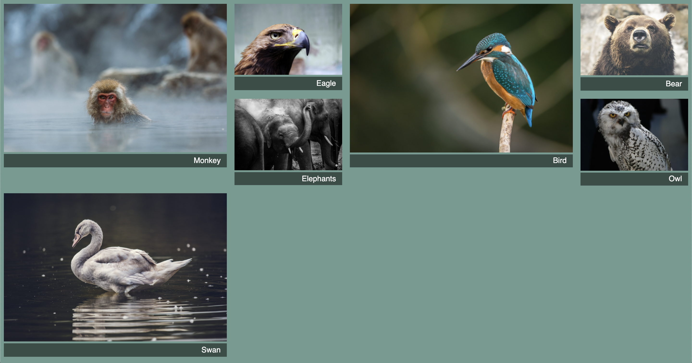

# Listing-6.10

現時点では画像を `1 x 1` のグリッド領域に表示されているだけだが、特定のクラスを付与した画像は `2 x 2` のグリッド領域に表示するようにする。

```css
.portfolio .featured {
  grid-row: span 2;
  grid-column: span 2;
}
```

ただしこうすると以下のような表示になり、いくらか隙間が空いてしまっている状況になってしまう。


ここで `grid-auto-flow` というプロパティを使用すれば、グリッドの配置アルゴリズムの動作を制御することができ、`row` を指定すればグリッド外にはみ出したアイテムは 1 行下に追加されるようになり、`column` を指定すればグリッド外にはみ出したアイテムは最初に列に配置して列がいっぱいになってから次の行に移動する。

`grid-auto-flow: dense` を使用すれば、グリッドアイテムの表示順を変更して、グリッドの隙間を埋めようとするアルゴリズムが働く。

```css
.portfolio {
  display: grid;
  grid-template-columns: repeat(auto-fill, minmax(200px, 1fr));
  grid-auto-rows: 1fr;
  grid-gap: 1em;
  grid-auto-flow: dense;
}
```

これで以下のように空いた隙間にグリッドアイテムを配置するようになっていることがわかる。



> ただし `dense` を使用した場合、アイテムが HTML に表示されているのと順番が異なってしまうことがあり、キーボード操作で混乱を発生させる可能性がある。
