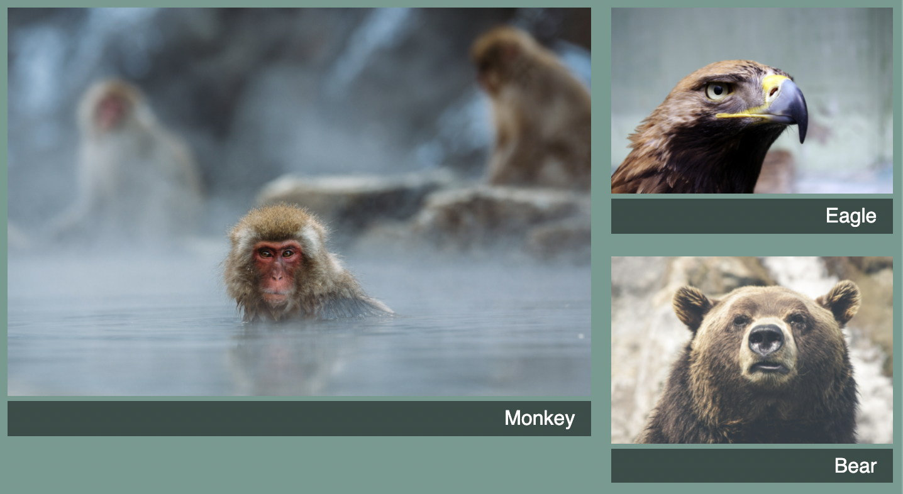

# Listing-6.11

今の設定では、`2 x 2` グリッドで画像を表示してしまうと、グリッドトラック上の他のアイテムと上端と下端がずれてしまい、画像の間に小さな隙間ができてしまう。



この原因は、以下のように各グリッドアイテム自体はグリッドエリア全体を埋めるように引き延ばされるにも関わらず、子要素自体はグリッドエリアを埋めるように引き延ばされないため、高さが余ってしまうからである。

これは高さ方向にスペースを埋めるようにしたいため、フレックスボックスを使用する。

ただし画面を引き伸ばす際には、そのアスペクト比を崩さないように以下の `object-fit` プロパティを設定する必要がある。

| property  | description                                     |
| :-------- | :---------------------------------------------- |
| `cover`   | 枠いっぱいに画像を拡大する (切り取られる)       |
| `contain` | 枠いっぱいに画像サイズを変更する (隙間ができる) |

実際には枠自体を `flex-grow` で拡大させて、その枠に合わせて画像をアスペクト比を保ったまま拡大し、はみ出た部分を切り取るような設定に変更する。

```css
.portfolio > figure {
  display: flex;
  flex-direction: column;
  margin: 0;
}

.portfolio img {
  flex: 1;
  object-fit: cover;
  max-width: 100%;
}
```

これで以下のように画像が拡大されていることがわかる。


## 参考資料

- [A Quick Overview of `object-fit` and `object-position`](https://css-tricks.com/on-object-fit-and-object-position/)
