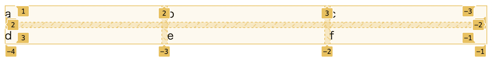
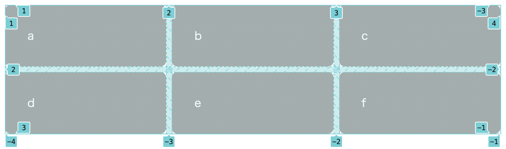

# Listing-6.2

では以下の HTML をベースに 2 行 3 列のレイアウトを作成する。

```html
<div class="grid">
  <div class="a">a</div>
  <div class="b">b</div>
  <div class="c">c</div>
  <div class="d">d</div>
  <div class="e">e</div>
  <div class="f">f</div>
</div>
```

まずはグリッドコンテナとして識別させるために `.grid` 要素に以下を適用する。

```css
.grid {
  display: grid;
  grid-template-columns: 1fr 1fr 1fr;
  grid-template-rows: 1fr 1fr;
  grid-gap: 0.5em;
}
```

これで以下のようにグリッドコンテナが作成され、指定した通りの行と列の数やグリッドアイテム間の隙間が設定されていることがわかる。



`display: grid;` を適用することでブロック要素のように使用可能な幅を `100%` 埋めるようにグリッドアイテムが展開される。

`grid-template-columns/rows` で使用している `1fr` は **fraction unit** と呼ばれるものであり、`flex-grow` のようにグリッドコンテナが確保している幅を埋めるようにグリッドアイテムを拡張するための単位系である。

また `grid-gap: 0.5em;` を使用することで垂直方向と水平方向に対する、各グリッドアイテム間の幅を調整することができる。

あとは各グリッドアイテムに対して `padding` が背景色を適用する。

```css
.grid > * {
  background-color: darkgray;
  color: white;
  padding: 2em;
  border-radius: 0.5em;
}
```

これで以下のようにグリッドアイテムが描画されている。


