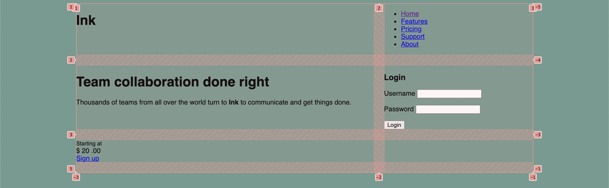
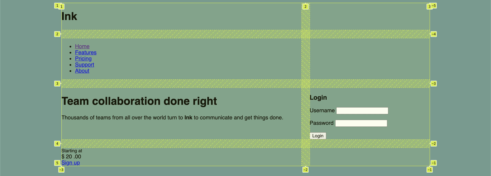
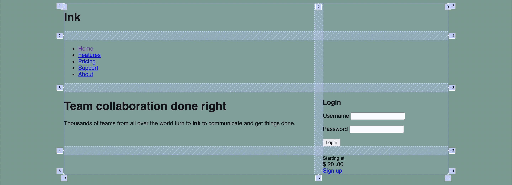
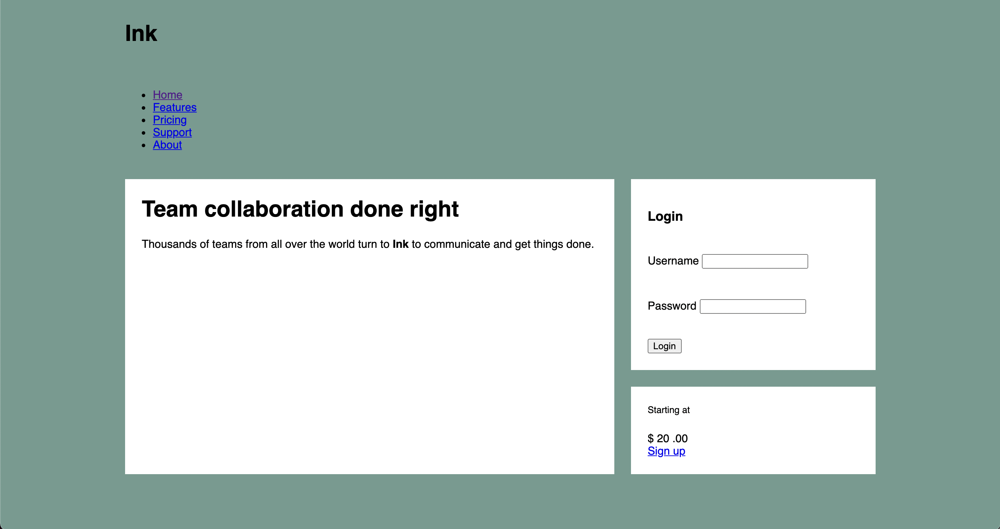

# Listing-6.4

では以下の構造を 4 行 2 列のグリッドレイアウトに変更する。

```html
<body>
  <div class="container">
    <header></header>

    <nav></nav>

    <main class="main tile"></main>

    <div class="sidebar-top tile"></div>

    <div class="sidebar-bottom tile centered"></div>
  </div>
</body>
```

グリッドコンテナとしては、4 行 2 列を再現し、各グリッドアイテム間の隙間を調整する必要がある。

```css
.container {
  display: grid;
  grid-template-columns: 2fr 1fr;
  grid-template-rows: repeat(4, auto);
  grid-gap: 1.5em;
  max-width: 1080px;
  margin: 0 auto;
}
```

この状態だと各アイテムが左上から自動的に埋めるように配置される。



`<header>` 要素と `<nav>` 要素に対しては、上記の描画結果から、列方向には `1 ~ 3` まで配置させる必要があり、行方向に対してはそれぞれ 1 行分を埋めるように指定する必要がある。

```css
header,
nav {
  grid-column: 1 / 3;
  grid-row: span 1;
}
```

これで下記のようにヘッダーとナビゲーションが横幅いっぱいに描画されるように調整できる。



あとは上記の列番号と行番号をもとに、メインコンテンツとサイドコンテンツを配置すればいい。

```css
.main {
  grid-column: 1 / 2;
  grid-row: 3 / 5;
}

.sidebar-top {
  grid-column: 2 / 3;
  grid-row: 3 / 4;
}

.sidebar-bottom {
  grid-column: 2 / 3;
  grid-row: 4 / 5;
}
```



これでグリッドアイテムを配置することはできたので、あとは各グリッドアイテムのコンテンツに対するスタイルを適用すればいい。


