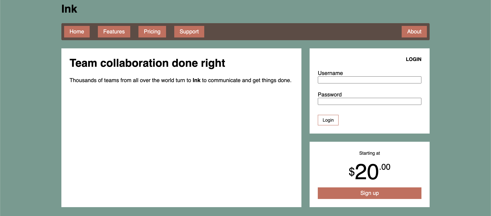

# Listing-6.5

フレックスボックスとグリッドレイアウトでは、以下の 2 点が異なっている。

- フレックスボックスは 1 次元方向だが、グリッドレイアウトは 2 次元方向
- フレックスボックスはコンテンツの外側から動作するのに対し、グリッドレイアウトはレイアウトの内側から動作する
  - フレックスボックスはサイズを明示的に指定する必要はない
  - グリッドレイアウトはグリッドアイテムのサイズに合わせてトラック全体のサイズにも影響を与える

このためナビゲーション部分のタブの構成や、サイドバー部分のフォームの構成は 1 次元方向なのでフレックスボックスを採用してスタイルを作成する。

```css
.page-heading {
  margin: 0;
}

.site-nav {
  display: flex;
  margin: 0;
  padding: 0.5em;
  background-color: #5f4b44;
  list-style-type: none;
  border-radius: 0.2em;
}

.site-nav > li {
  margin-top: 0;
}

.site-nav > li > a {
  display: block;
  padding: 0.5em 1em;
  background-color: #cc6b5a;
  color: white;
  text-decoration: none;
}

.site-nav > li + li {
  margin-left: 1.5em;
}

.site-nav > .nav-right {
  margin-left: auto;
}

.login-form h3 {
  margin: 0;
  font-size: 0.9em;
  font-weight: bold;
  text-align: right;
  text-transform: uppercase;
}

.login-form input:not([type="checkbox"]):not([type="radio"]) {
  display: block;
  margin-top: 0;
  width: 100%;
}

.login-form button {
  margin-top: 1em;
  border: 1px solid #cc6b5a;
  background-color: white;
  padding: 0.5em 1em;
  cursor: pointer;
}

.centered {
  text-align: center;
}

.cost {
  display: flex;
  justify-content: center;
  align-items: center;
  line-height: 0.7;
}

.cost > span {
  margin-top: 0;
}

.cost-currency {
  font-size: 2rem;
}
.cost-dollars {
  font-size: 4rem;
}
.cost-cents {
  font-size: 1.5rem;
  align-self: flex-start;
}

.cta-button {
  display: block;
  background-color: #cc6b5a;
  color: white;
  padding: 0.5em 1em;
  text-decoration: none;
}
```

これで元々のページを再現することが可能となった。


