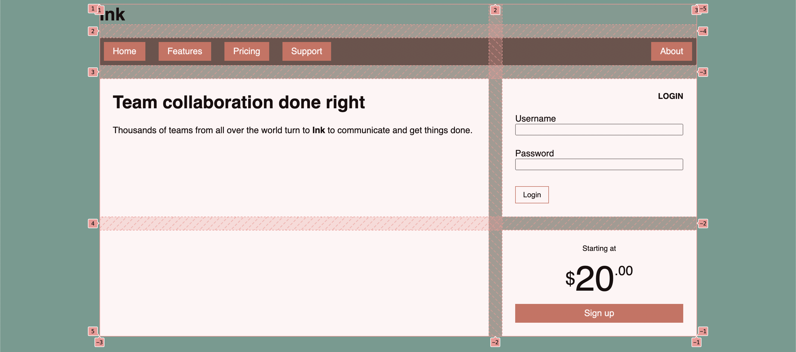

# Listing-6.6

各グリッドアイテムを、どの領域に配置するのか決定するために、下記の画面で表示されている `grid line` の行と列の番号を指定していた。



グリッドレイアウトでは、`grid line` に対して特定の命名を与えることで、命名を指定することでグリッドアイテムをどの行と列に配置するのか決定することができる。

例えば列に対して以下のようにして特定の命名を与える。

```css
grid-template-columns:
  [left-start] 2fr
  [left-end right-start] 1fr
  [right-end];
```

こうすることで以下のようにメインコンテンとを左側、サイドコンテンツを右側に配置するような設定を追加することができる。

```css
.main {
  grid-column: left-start / left-end;
  grid-row: row 3 / span 2;
}

.sidebar {
  grid-column: right-start / right-end;
  grid-row: row 3 / snap 2;
}
```

実際にグリッドレイアウト形式でページのスタイルを描き直してみる。

```css
.container {
  display: grid;
  grid-template-columns:
    [left-start] 2fr
    [left-end right-start] 1fr
    [right-end];
  grid-template-rows: repeat(4, [row] auto);
  grid-gap: 1.5em;
  max-width: 1080px;
  margin: 0 auto;
}

header,
nav {
  grid-column: left-start / right-end;
  grid-row: span 1;
}

.main {
  grid-column: left;
  grid-row: row 3 / span 2;
}

.sidebar-top {
  grid-column: right;
  grid-row: 3 / 4;
}

.sidebar-bottom {
  grid-column: right;
  grid-row: 4 / 5;
}
```
