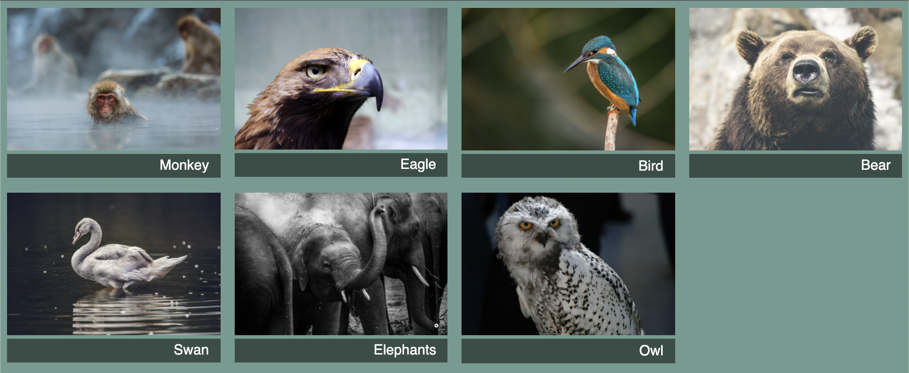

# Listing-6.9

今までは画面に配置するグリッドアイテムの数が事前に判明していたことを前提としていたが、実際には描画するアイテムをバックエンドから取得する場合にはグリッドアイテムの数が事前にわからない可能性がある。

`grid-template-*` を使用すれば明示的なグリッドレイアウトを構築することができるが、グリッドアイテム自体は明示的なトラックの外側にも配置することができる。

この挙動を確認するためのページを作成する。

```html
<div class="portfolio">
  <figure class="featured">
    
    <figcaption>Monkey</figcaption>
  </figure>
  <figure>
     2
    <figcaption>Eagle</figcaption>
  </figure>
  <figure class="featured">
    
    <figcaption>Bird</figcaption>
  </figure>
  <figure>
    
    <figcaption>Bear</figcaption>
  </figure>
  <figure class="featured">
    
    <figcaption>Swan</figcaption>
  </figure>
  <figure>
    
    <figcaption>Elephants</figcaption>
  </figure>
  <figure>
    
    <figcaption>Owl</figcaption>
  </figure>
</div>
```

いくつかの画像は他の画像よりも大きく表示するために `.featured` クラスを使用している。

今回では、グリッドトラックに固定のサイズを設定するのではなく、一定の最小値と最大値の範囲内で制約を与えたい場合がある。この時は、`minmax` 関数を使用して、`1fr` と `200px` を指定することで最小値は `200px` 、最大値はスクリーン幅に合わせて `1fr` で自動的に調整するようにする。

こうしておけば、スクリーン幅に対して `200px` からはみ出してしまうような場合は暗黙的なグリッドレイアウトに配置されることになる。

`repeat` 関数で使用できる `auto-fill` キーワードを使用すると、指定されたサイズによる制限に違反することのないように、配置できるだけのトラックをグリッドに配置する。

```css
.portfolio {
  display: grid;
  grid-template-columns: repeat(auto-fill, minmax(200px, 1fr));
  grid-auto-rows: 1fr;
  grid-gap: 1em;
}
```

あとは各グリッドの幅に画像を配置するために、幅 `100%` を指定する。

```css
.portfolio img {
  max-width: 100%;
}
```

これで以下のように整列された状態で描画される。



## 参考資料

- [Grid by Example](https://gridbyexample.com/examples/example37/)
