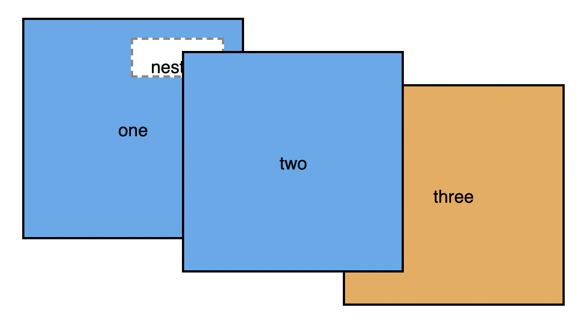

# Listing-7.10

`z-index` は位置を調整した要素同士の高さを調整する際に便利なプロパティである。

しかし 1 つの要素に `z-index` を指定すると、その要素をルートとして新しいスタッキングコンテキストが作成されてしまい、その子孫要素は全てそのスタッキングコンテキストの一部となる。

この挙動を以下の HTML を使って確認する。

```html
<div class="box one positioned">
  one
  <div class="absolute">nested</div>
</div>
<div class="box two positioned">two</div>
<div class="box three">three</div>
```

ここで以下のようなスタッキングコンテキストを作成する。

```css
.positioned {
  position: relative;
  z-index: 1;
}

.absolute {
  position: absolute;
  /* ... */
  z-index: 100;
}
```

これは以下のように描画されており、`z-index` の値が大きい要素が表示されているわけではないことがわかる。



これは `box one` がそもそも `box two` の後ろに描画されているため、`z-index` をいかに大きく取ったとしても、`box two` より前面に表示されることはないためである。

> 他にも不透明度を 1 以下にしたり、`transform` や `filter` を使用するとスタッキングコンテキストが作成される。

こうした `z-index` の値は以下のように変数として定義しておくと便利である。

```css
--z-loading-indicator: 100;
--z-nav-menu: 200;
--z-dropdown-menu: 300;
--z-modal-backprop: 400;
--z-modal-body: 410;
```
