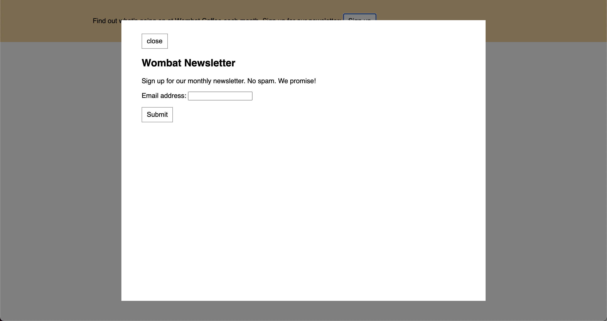
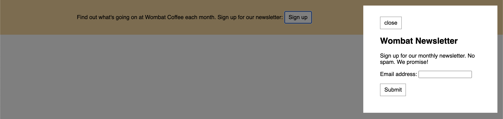

# Listing-7.2-sidenav

モーダルの構造としては、背景色とモーダルボックスの 2 つで構成されており、以下の HTML でも `modal-backprop` 要素と `modal-body` 要素で構成されている。

```html　　
<div class="modal" id="modal">
  <div class="modal-backdrop"></div>
  <div class="modal-body">
    <button class="modal-close" id="close">close</button>
    <h2>Wombat Newsletter</h2>
    <p>Sign up for our monthly newsletter. No spam. We promise!</p>
    <form>
      <p>
        <label for="email">Email address:</label>
        <input type="text" name="email" />
      </p>
      <p><button type="submit">Submit</button></p>
    </form>
  </div>
</div>
```

まずはモーダル自体は初期表示時には画面に出さないため、以下のスタイルを設定する。

```css
.modal {
  display: none;
}
```

モーダルを表示した際の背景色は、以下のように `position: fixed;` とした上で `top`, `right`, `bottom`, `left` を全て 0 に設定するとビューポート全体をカバーする形にできる。

```css
.modal-backdrop {
  position: fixed;
  top: 0;
  right: 0;
  bottom: 0;
  left: 0;
  background-color: rgba(0, 0, 0, 0.5);
}
```

モダールボックス自体は、ビューポートの上下左右からの配置場所を指定することで、自動的にモーダルボックス自体の横幅も決定することができる。

```css
.modal-body {
  position: fixed;
  top: 3em;
  bottom: 3em;
  right: 20%;
  left: 20%;
  padding: 2em 3em;
  background-color: white;
  overflow: auto;
}
```

上記のように上下の隙間は `3em` ずつ確保した上で、左右からの隙間はそれぞれ `20%` にすることで、下記のようにモーダルボックス自体の横幅はビューポートに対して `60%` の大きさになっている。



この方法によるモーダルボックスの実装は、ページスクロールに影響されないナビゲーションを表示させることもでき、ビューポートでの配置場所と `width` や `height` などを指定すればいい。

```css
.modal-body {
  position: fixed;
  top: 1em;
  right: 1em;
  width: 20%;
}
```

こうすると以下のようにスクロールしても描画場所が変化しないモーダルボックスを作成することができた。


