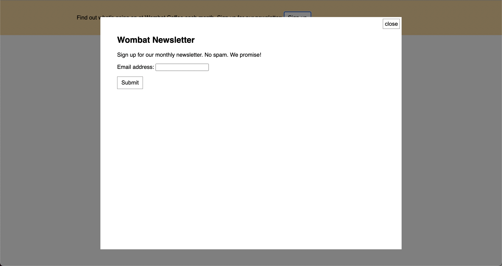

# Listing-7.3

要素の配置方法は `position: fixed;` 以外にも存在している。

| `property` | description                      |
| :--------- | :------------------------------- |
| `fixed`    | ビューポートに対する相対的な配置 |
| `absolute` | 最も近い祖先に対する相対的な配置 |

ここでモーダルの閉じるボタンを `absolute` を使って配置する。

元々のモーダルの HTML 構造は以下のようになってきた。

```html
<div class="modal-body">
  <button class="modal-close" id="close">close</button>
  <h2>Wombat Newsletter</h2>
  <p>Sign up for our monthly newsletter. No spam. We promise!</p>
  <form>
    <p>
      <label for="email">Email address:</label>
      <input type="text" name="email" />
    </p>
    <p><button type="submit">Submit</button></p>
  </form>
</div>
```

ここで `.modal-close` 要素に対して `absolute` を適用すると、その親要素である `modal-body` 要素に対する相対的な配置を指定することができる。

例えば以下のような CSS を適用すれば、モーダルボックス自体の上辺と右端からどの程度離れた場所に配置するのかを決定することができる。

```css
.modal-close {
  position: absolute;
  top: 0.3em;
  right: 0.3em;
  padding: 0.3em;
  cursor: pointer;
}
```

これで以下のように配置することができている。


