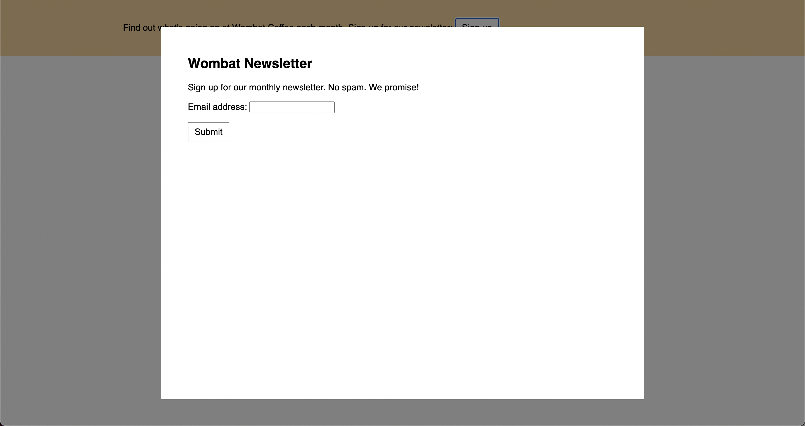
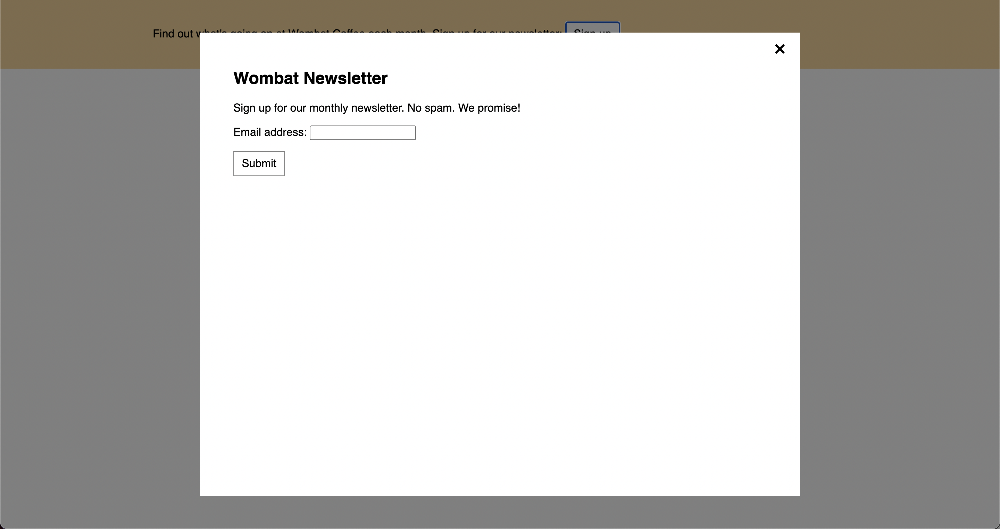

# Listing-7.4

もしもモーダルを閉じるためのボタンを「close」ではなく「x」に置き換えたい場合、単純に単語を削除して「x」に置換するだけだと、スクリーンリーダーなどはボタンのテキストを読み上げることができず、ボタンの目的が伝わらないというアクセサビリティの問題が発生する。

そこで CSS を使用して元々の文字を隠し、代わりに擬似クラスなどを使用して「x」を表示する必要がある。

```css
.modal-close {
  position: absolute;
  top: 0.3em;
  right: 0.3em;
  padding: 0.3em;
  cursor: pointer;
  /* 擬似クラスでもフォントサイズを変更するため */
  font-size: 2em;
  /* 「close」の文字列を存在させたまま、外に押し出す */
  height: 1em;
  width: 1em;
  text-indent: 10em;
  /* 押し出し文字列を隠す */
  overflow: hidden;
  /* 表示された境界線を削除する */
  border: 0;
}
```

これで以下のように「close」文字列が隠れるようになっていることがわかる。



次に代わりとして「x」を表示するように変更する。

```css
.modal-close::after {
  /* 親要素となる .modal-close に対する相対的な配置 */
  position: absolute;
  /* 試行錯誤として色々ずらす */
  line-height: 0.5;
  top: 0.2em;
  left: 0.1em;
  /* フォント周りの設定は継承されるので、改めて0に戻す */
  text-indent: 0;
  /* エスケープされたユニコードの数字を使用する */
  content: "\00D7";
}
```

これで以下のように「x」が表示されるようになった。


