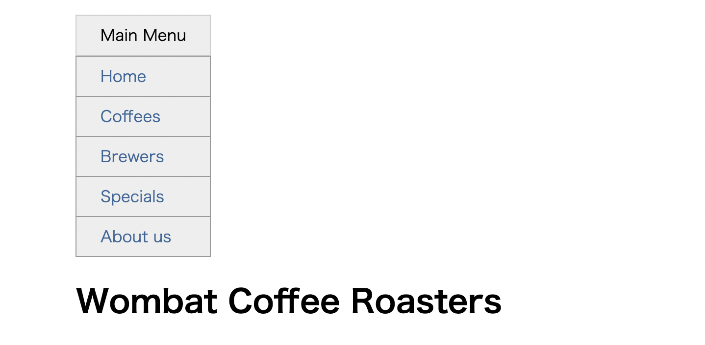

# Listing-7.5

以下の HTML 構造をベースとして、ドロップダウンのメニューボックスを作成する。

```html
<div class="container">
  <nav>
    <div class="dropdown">
      <div class="dropdown-label">Main Menu</div>
      <div class="dropdown-menu">
        <ul class="submenu">
          <li><a href="/">Home</a></li>
          <li><a href="/coffees">Coffees</a></li>
          <li><a href="/brewers">Brewers</a></li>
          <li><a href="/specials">Specials</a></li>
          <li><a href="/about">About us</a></li>
        </ul>
      </div>
    </div>
  </nav>

  <h1>Wombat Coffee Roasters</h1>
</div>
```

ドロップダウンコンテナは、常に表示しているラベルの項目と、マウスをホバーさせたときに初めて表示させるサブメニューで構成されている。

```css
.container {
  width: 80%;
  max-width: 1000px;
  margin: 1em auto;
}

.dropdown {
  display: inline-block;
}

.dropdown-label {
  padding: 0.5em 1.5em;
  border: 1px solid #ccc;
  background-color: #eee;
}

.submenu {
  padding-left: 0;
  margin: 0;
  list-style-type: none;
  border: 1px solid #999;
}

.submenu > li + li {
  border-top: 1px solid #999;
}

.submenu > li > a {
  display: block;
  padding: 0.5em 1.5em;
  background-color: #eee;
  color: #369;
  text-decoration: none;
}

.submenu > li > a:hover {
  background-color: #fff;
}
```

これで以下のように、スタイルを当てていない状態では、サブメニューが完全に表示されている状態にできた。


