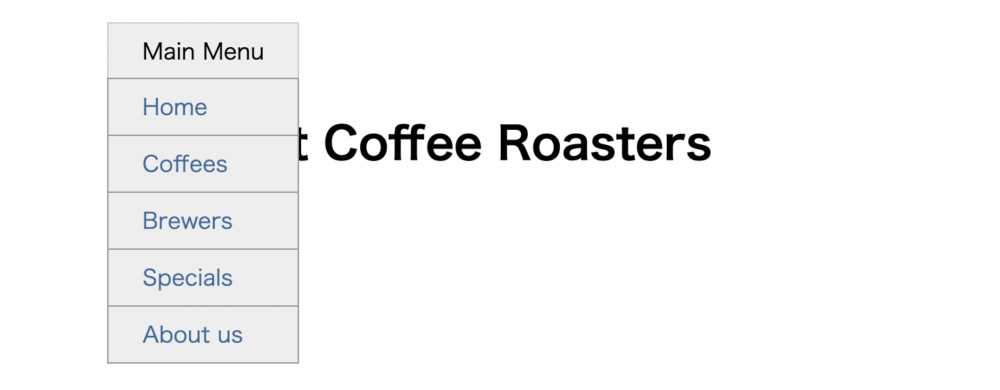

# Listing-7.5

以下の HTML 構造をベースとして、ドロップダウンのメニューボックスを作成する。

```html
<div class="container">
  <nav>
    <div class="dropdown">
      <div class="dropdown-label">Main Menu</div>
      <div class="dropdown-menu">
        <ul class="submenu">
          <li><a href="/">Home</a></li>
          <li><a href="/coffees">Coffees</a></li>
          <li><a href="/brewers">Brewers</a></li>
          <li><a href="/specials">Specials</a></li>
          <li><a href="/about">About us</a></li>
        </ul>
      </div>
    </div>
  </nav>

  <h1>Wombat Coffee Roasters</h1>
</div>
```

まずは基準となる `.dropdown` 要素に対してサブメニューを配置させるために、以下のように基準とするための `position: relative;` を宣言する。

```css
.dropdown {
  display: inline-block;
  /* sabumenu の基準とする */
  position: relative;
}
```

次にサブメニュー自体をまずは表示しないようにして、絶対位置を `.dropdown` 要素をベースにしてずらして配置するようにする。

```css
.dropdown-menu {
  display: none;
  position: absolute;
  left: 0;
  top: 2.1em;
  /* メインメニューの幅と合わせるために、最小幅を親要素と合わせる */
  min-width: 100%;
  background-color: #eee;
}

/* ドロップダウン全体をホバーされた際に表示させる (display: none -> block) */
.dropdown:hover .dropdown-menu {
  display: block;
}
```

これで以下のようにマウスをホバーさせた際にサブメニューが表示される。


