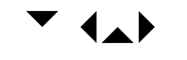

# Listing-7.7-border-color

次にサブメニューを開く前に表示されているメインメニューの横には、メニューを開くことができることを表す「▽」が表示したい。

「▽」の作成方法はさまざま存在しているが、CSS で実現するための 1 つの方法は境界線のプロパティ `border` を調整する方法である。

実際に以下の要素を使用してさまざまな三角形を作成してみる。

```html
<div>
  <div></div>
  <div></div>
  <div></div>
  <div></div>
</div>
```

これで例えば境界線を空の要素に対して表示させ、境界線のうち三角形を表示させたい部分だけ線の色を描画させるようにする。

```css
.border-top {
  display: inline-block;
  content: "";
  border: 1em solid;
  border-color: black transparent transparent transparent;
}

.border-right {
  display: inline-block;
  content: "";
  border: 1em solid;
  border-color: transparent black transparent transparent;
}

.border-bottom {
  display: inline-block;
  content: "";
  border: 1em solid;
  border-color: transparent transparent black transparent;
}

.border-left {
  display: inline-block;
  content: "";
  border: 1em solid;
  border-color: transparent transparent transparent black;
}
```

こうすると以下のように三角形を表示させることができるようになった。


