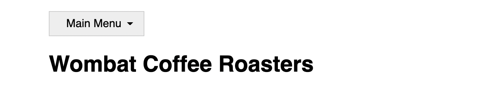
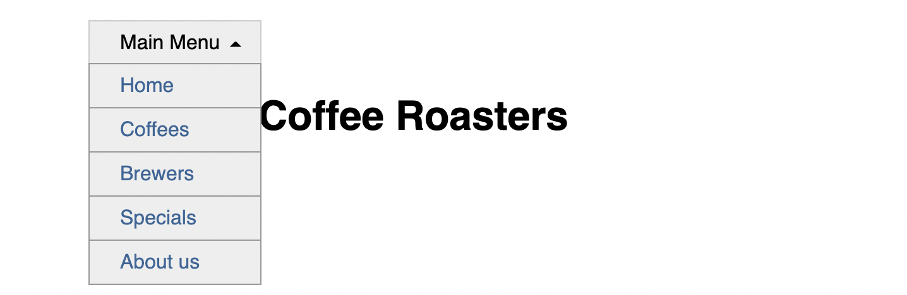

# Listing-7.7

次にサブメニューを開く前に表示されているメインメニューの横には、メニューを開くことができることを表す「▽」が表示したい。

「▽」の作成方法はさまざま存在しているが、CSS で実現するための 1 つの方法は境界線のプロパティ `border` を調整する方法である。

では実際に以下のメインメニューの隣に三角形を描画するようにしてみる。

```html
<nav>
  <div class="dropdown">
    <div class="dropdown-label">Main Menu</div>
    <!-- ... -->
  </div>
</nav>
```

まずはメインメニューの右隣に三角形を描画するための余白を多めに確保し、実際に境界線を利用して描画するようにしてみる。

```css
.dropdown-label {
  /* 右端の余白を多めに確保する */
  padding: 0.5em 2em 0.5em 1.5em;
  border: 1px solid #ccc;
  background-color: #eee;
}

.dropdown-label::after {
  content: "";
  position: absolute;
  right: 1em;
  top: 1em;
  /* ▽ を表示する */
  border: 0.3em solid;
  border-color: black transparent transparent;
}

.dropdown:hover .dropdown-label::after {
  top: 0.7em;
  /* △ を表示する */
  border-color: transparent transparent black;
}
```

これでマウスをホバーしていない状態では「▽」、マウスをホバーしている状態では「△」が表示されていることがわかる。

|              not hover              |                hover                |
| :---------------------------------: | :---------------------------------: |
|  |  |

## 参考資料

- [The Shapes of CSS](https://css-tricks.com/the-shapes-of-css/)
