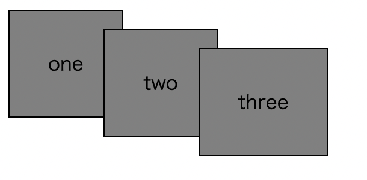
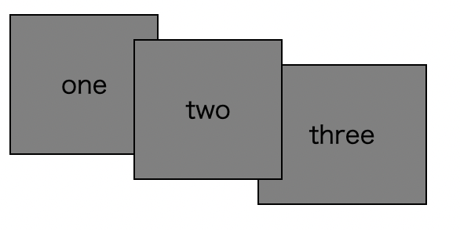
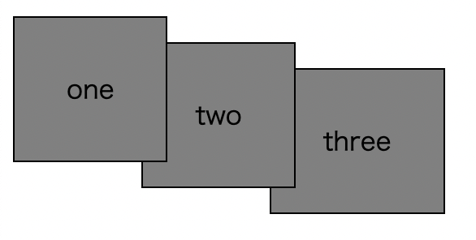

# Listing-7.8-stacking-contexts

ブラウザは HTML を解析して DOM を作成する際にレンダリングツリーを構築し、このツリー構造がブラウザが要素を描画する順序を決定する役割を担っている。

通常は HTML の中で要素が表示される順番によって決定される。

```html
<div class="default-container">
  <div>one</div>
  <div>two</div>
  <div>three</div>
</div>
```

これで負の `margin` を指定した場合、以下のように HTML 上での表示順に従って上に重なって表示されていることがわかる。



これで最初の要素と 2 番目の要素に `relative` を指定した場合、以下のように最初の要素の上に 2 番目の要素が描画されていることがわかる。



つまり、`relative` 同士の要素の場合には、HTML 上での表示順に従って画面に描画されていることがわかる。

しかし、HTML での表示順とは異なる順番で要素を重ねたい場合も存在する。

そうした場合には `z-index` というプロパティを使用することで、要素のスタッキングに関する問題を解決することができるようになる。

では実際に最初の要素と 2 番目の要素に対して以下のようなプロパティを追加する。

```css
.z-index-container .one {
  position: relative;
  z-index: 2;
}

.z-index-container .two {
  position: relative;
  z-index: 1;
  margin-top: 1em;
  margin-left: -1em;
}
```

こうすると値の大きい方がより前面にスタッキングされるため、以下のように最初の要素が前面に表示されるようになる。


