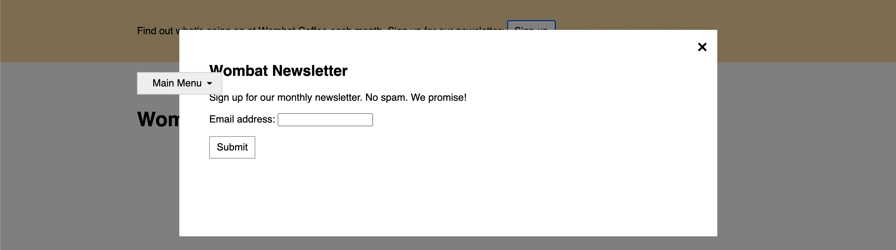

# Listing-7.8

ではドロップダウンメニューと、モーダルボックスを一緒に使用するとどのように表示されるでしょうか。



上記のように `fixed` と `relative` で位置調整を行なった要素が重なって表示されてしまっていることがわかる。

これは `position` プロパティを設定した際に、サブメニューの方が HTML 上での表示順が後であるため、モーダルよりも前面にスタッキングされているからである。

`fixed` 値を有している要素の場合は、HTML 内のどの場所に移動させてもそれほど影響がない傾向ではあるが、`absolute` や `relative` は親要素や子要素との関係性が含まれているため、自由に HTML 上に配置できるわけではない。

そこで要素の高さを調整するための `z-index` を使用する。

```css
.modal-backdrop {
  position: fixed;
  top: 0;
  right: 0;
  bottom: 0;
  left: 0;
  background-color: rgba(0, 0, 0, 0.5);
  z-index: 1;
}

.modal-body {
  position: fixed;
  top: 3em;
  bottom: 3em;
  right: 20%;
  left: 20%;
  padding: 2em 3em;
  background-color: white;
  overflow: auto;
  z-index: 2;
}
```
