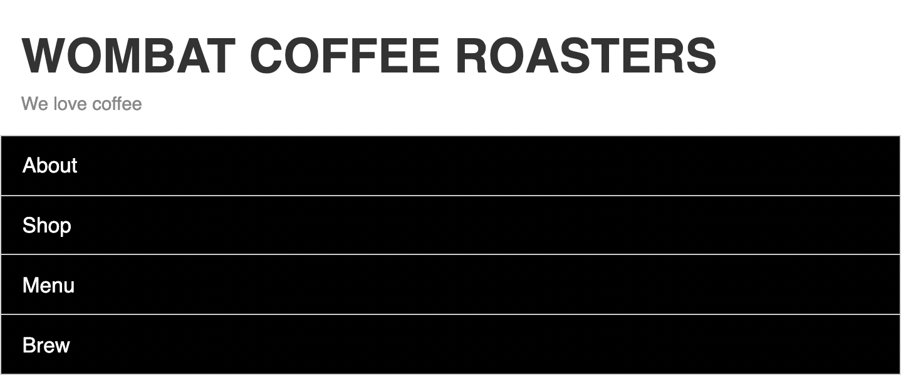
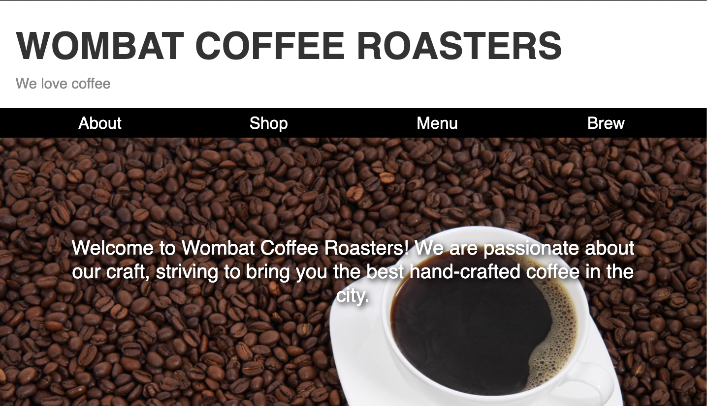

# Listing-8.10

メニューバーは以下の構造になっており、モバイルデザインではハンバーガーメニューとなってる。

デスクトップデザインでは、ハンバーガーメニューを削除して、常に画面に表示するようにしたい。

```html
<nav class="menu" id="main-menu">
  <button class="menu-toggle" id="toggle-menu">toggle menu</button>
  <div class="menu-dropdown">
    <ul class="nav-menu">
      <li><a href="/about.html">About</a></li>
      <li><a href="/shop.html">Shop</a></li>
      <li><a href="/menu.html">Menu</a></li>
      <li><a href="/brew.html">Brew</a></li>
    </ul>
  </div>
</nav>
```

まずはハンバーメニューを作成し、元々のメニューアイテムを表示させるように変更する。

```css
@media (min-width: 35em) {
  .menu-toggle {
    display: none;
  }

  .menu-dropdown {
    display: block;
    position: static;
  }
}
```

これで以下のようにハンバーガーメニューが消えていることがわかる。



```css
@media (min-width: 35em) {
  .nav-menu {
    display: flex;
    border: 0;
    padding: 0 1em;
  }

  /* ナビゲーションアイテムを横幅いっぱいに展開する */
  .nav-menu > li {
    flex: 1;
  }

  .nav-menu > li + li {
    border: 0;
  }

  .nav-menu > li > a {
    padding: 0.3em;
    text-align: center;
  }
}
```

これで以下のようにデスクトップのデザインに合わせたメニューバーの作成ができた。

特徴的な点としては、デスクトップデザインに変更するにあたって静的な（`static`）なブロック表示要素に戻す必要があったが、静的な配置に影響しない `top` などのプロパティを上書きする必要がない点である。


