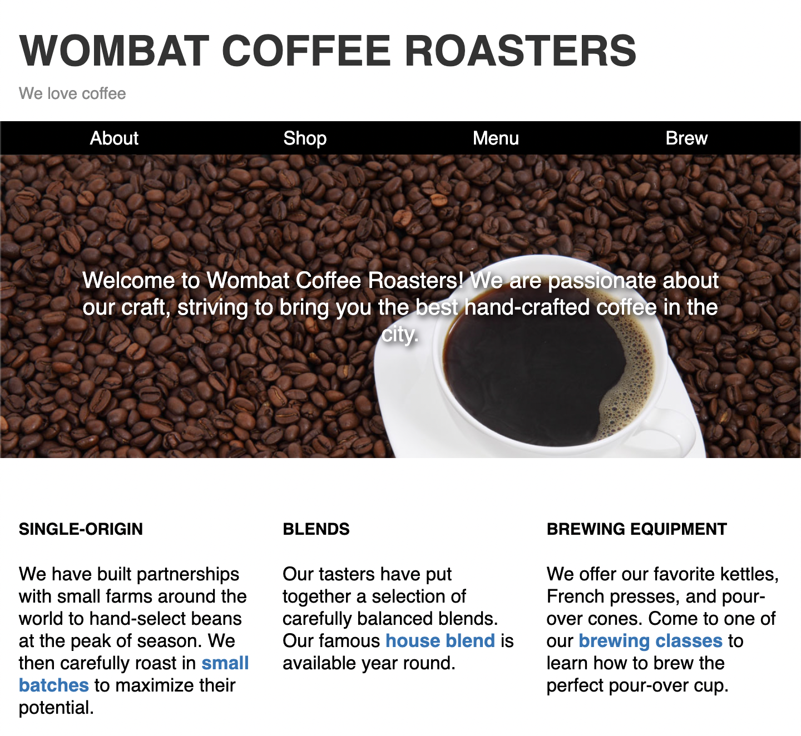

# Listing-8.11

デスクトップデザインになった場合には 1 カラムレイアウトから複数のカラムに自動的に変動するようなスタイル設定を実施する。

```html
<main id="main">
  <div class="row">
    <section class="column"></section>
    <section class="column"></section>
    <section class="column"></section>
  </div>
</main>
```

そこで下記のスタイルを適用して横方向にフレックスアイテムを並べていく。ただし、各アイテムに対して `margin-left` や `margin-right` などを設定すると、全てのアイテムの左右に余白が取られてしまうため、調整のために 1 行の左右方向の余白自体を大きめに確保するようにしておく。

```css
@media (min-width: 35em) {
  .row {
    display: flex;
    /* 各アイテムの左右方向の余白との調整のため少し左右方向に拡大する */
    margin-left: -0.75em;
    margin-right: -0.75em;
  }

  .column {
    flex: 1;
    margin-right: 0.75em;
    margin-left: 0.75em;
  }
}
```

これで以下のようにメインコンテンツが横一列に並んだ状態のレイアウトを再現することができる。



他にも自然な折り返しによって対応できる場合は、`flex-wrap: wrap` と `flex-basis` を組み合わせたり、グリッドレイアウトの `auto-fill` などを使用したりする。
