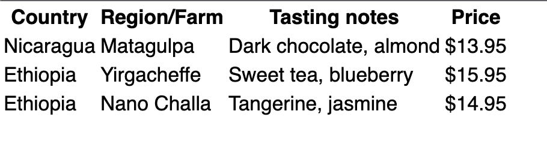
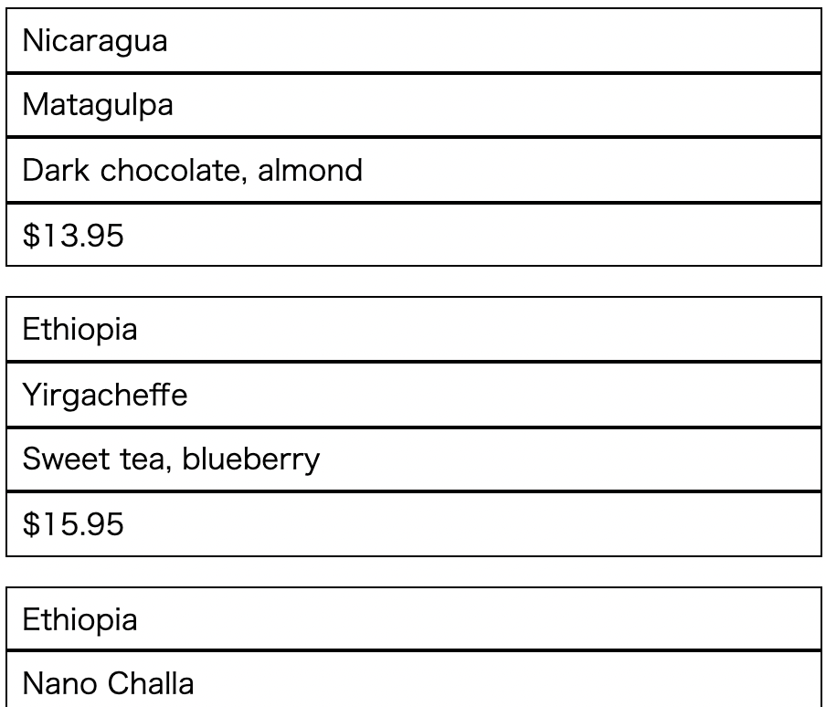

# Listing-8.14

テーブルに関してもレスポンシブデザインに適用することが可能である。

まずは以下の 3 行 4 列のテーブルレイアウトを考える。

```css
table {
  border-collapse: collapse;
}

th,
td {
  border: 1px solid black;
  padding: 0.3em 0.5em;
}

table {
  width: 100%;
}
```



ここでヘッダーは表示させないように、`thead tr` で画面上に表示させないようにしておき、1 行 1 行は `1em` 分の余白を確保するようにする。

```css
@media (max-width: 30em) {
  table,
  thead,
  tbody,
  tr,
  th,
  td {
    display: block;
  }

  thead tr {
    position: absolute;
    top: -9999px;
    left: -9999px;
  }

  tr {
    margin-bottom: 1em;
  }
}
```

これで以下のように幅を狭めた場合に以下のように 1 カラムレイアウトに変換することができるようになった。


