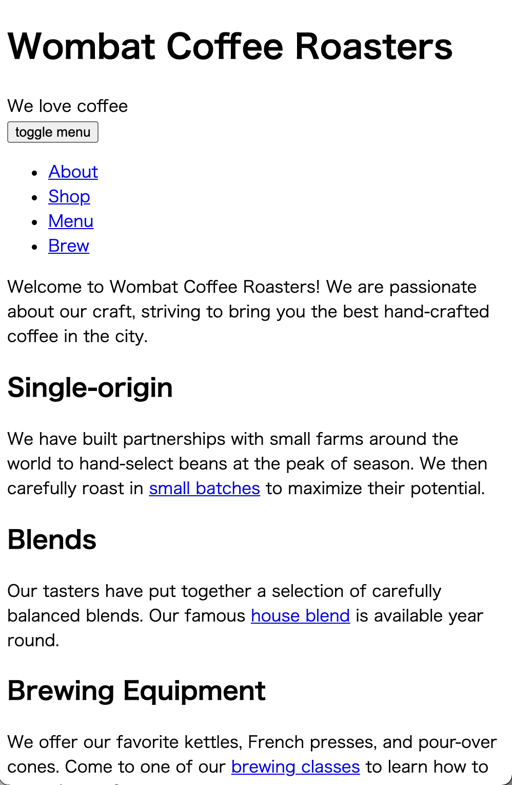
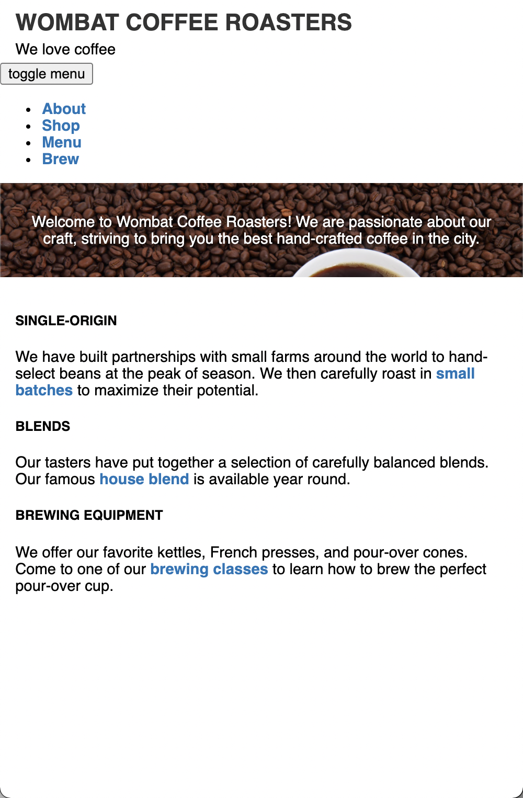

# Listing-8.1

レスポンシブデザインを想定した HTML 構造は以下のようになっていた。

```html
<header id="header" class="page-header"></header>

<nav class="menu" id="main-menu"></nav>

<aside id="hero" class="hero"></aside>

<main id="main"></main>
```

画面としては以下のように描画されている。



では基本的なスタイルを当てていく。

```css
:root {
  box-sizing: border-box;
  font-size: calc(1vw + 0.6em);
}

*,
*::before,
*::after {
  box-sizing: inherit;
}

body {
  margin: 0;
  font-family: Helvetica, Arial, sans-serif;
}

/* 
 * Link
 */
a:link {
  color: #1476b8;
  font-weight: bold;
  text-decoration: none;
}

a:visited {
  color: #1430b8;
}

a:hover {
  text-decoration: underline;
}

a:active {
  color: #b81414;
}

/* 
 * Header
 */
.page-header {
  padding: 0.4em 1em;
}

.title > h1 {
  color: #333;
  text-transform: uppercase;
  font-size: 1.5rem;
  margin: 0.2em 0;
}

/* 
 * Hero Image
 */
.hero {
  padding: 2em 1em;
  text-align: center;
  background-image: url(../assets/images/coffee-beans.jpg);
  background-size: 100%;
  color: #fff;
  /* テキストに影をつけることで、文字が背景画像の色で潰れてしまうことを回避する */
  text-shadow: 0.1em 0.1em 0.3em #000;
}

/* 
 * Main
 */
main {
  padding: 1em;
}

.subtitle {
  margin-top: 1.5em;
  margin-bottom: 1.5em;
  font-size: 0.875rem;
  text-transform: uppercase;
}
```


