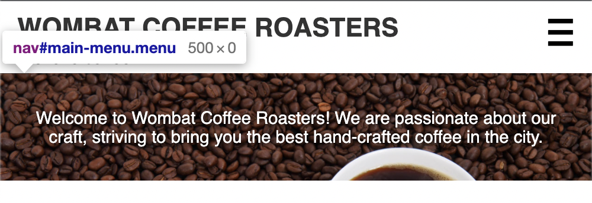
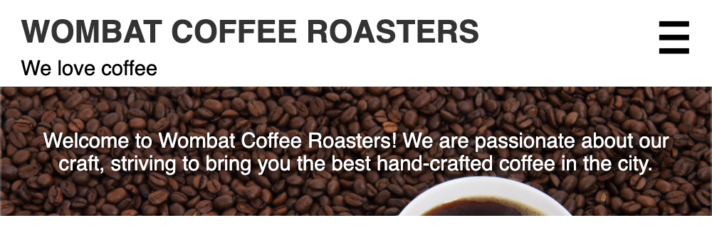
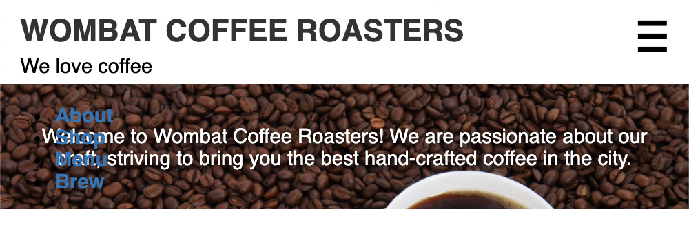

# Listing-8.3

では以下のナビゲーションメニューを、モバイルデザインを基準としたハンバーガーメニューで再現する。

```html
<nav class="menu" id="main-menu">
  <button class="menu-toggle" id="toggle-menu">toggle menu</button>
  <div class="menu-dropdown">
    <ul class="nav-menu">
      <li><a href="/about.html">About</a></li>
      <li><a href="/shop.html">Shop</a></li>
      <li><a href="/menu.html">Menu</a></li>
      <li><a href="/brew.html">Brew</a></li>
    </ul>
  </div>
</nav>
```

ポイントとしてはハンバーガーメニューをタイトルの左に表示させるために、全体を囲っている `.menu` 要素自体を、以下のように `relative` 位置に配置するようにし、メニュー自体の位置はそこからの想定位置として定義すればいい。



これで以下のように初期状態ではメニューのドロップダウンは非表示になっていることがわかる。



そして、`class="menu is-open"` のようにドロップダウンが表示されていることをクラスで表現するようにしておくと、表示の場合は以下のようにヒーロー画像の上部にリンクが表示されていることがわかる。


