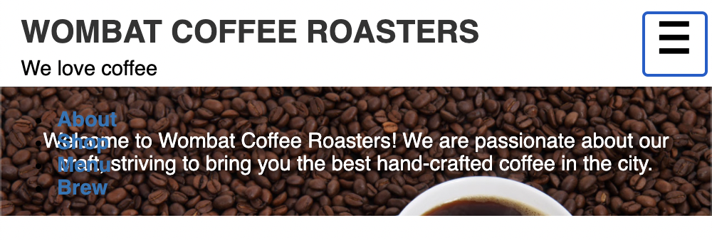

# Listing-8.4

あとは以下の HTML 構造を基準にして、`menu-toggle` 要素を押下した際にナビゲーションメニューが表示されるようになればいい。

```html
<nav class="menu" id="main-menu">
  <button class="menu-toggle" id="toggle-menu">toggle menu</button>
  <div class="menu-dropdown">
    <ul class="nav-menu">
      <li><a href="/about.html">About</a></li>
      <li><a href="/shop.html">Shop</a></li>
      <li><a href="/menu.html">Menu</a></li>
      <li><a href="/brew.html">Brew</a></li>
    </ul>
  </div>
</nav>
```

これは以下のような `JavaScript` で実現する。

```html
<script type="text/javascript">
  (function () {
    const button = document.getElementById("toggle-menu");
    button.addEventListener("click", function (event) {
      event.preventDefault();
      const menu = document.getElementById("main-menu");
      menu.classList.toggle("is-open");
    });
  })();
</script>
```


