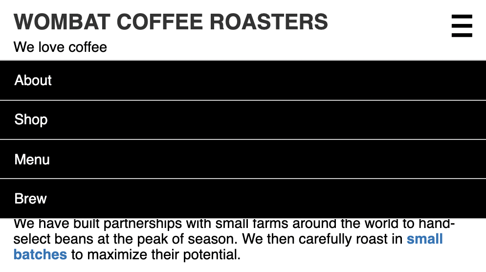

# Listing-8.5

あとは以下の HTML 構造を基準にして、`menu-toggle` 要素を押下した際にナビゲーションメニューが表示されるようになればいい。

```html
<nav class="menu" id="main-menu">
  <button class="menu-toggle" id="toggle-menu">toggle menu</button>
  <div class="menu-dropdown">
    <ul class="nav-menu">
      <li><a href="/about.html">About</a></li>
      <li><a href="/shop.html">Shop</a></li>
      <li><a href="/menu.html">Menu</a></li>
      <li><a href="/brew.html">Brew</a></li>
    </ul>
  </div>
</nav>
```

あとはナビゲーションメニュー自体のスタイルを以下のように調整していけばいい。

```css
/*
 * Navigation Menu
 */
.nav-menu {
  margin: 0;
  padding-left: 0;
  border: 1px solid #ccc;
  list-style: none;
  background-color: #000;
  color: #fff;
}

.nav-menu > li + li {
  border-top: 1px solid #ccc;
}

/* 実際にクリックするリンク自体は、padding を設けて大きめの判定にする */
.nav-menu > li > a {
  display: block;
  padding: 0.8em 1em;
  color: #fff;
  font-weight: normal;
}
```

これで以下のように表示されるようになった。


