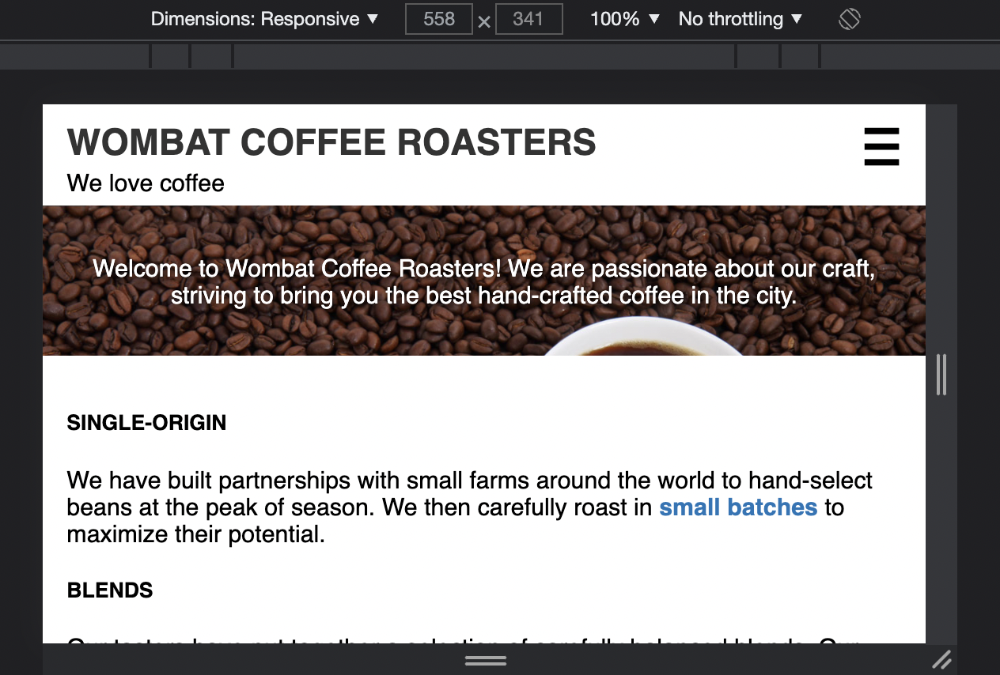
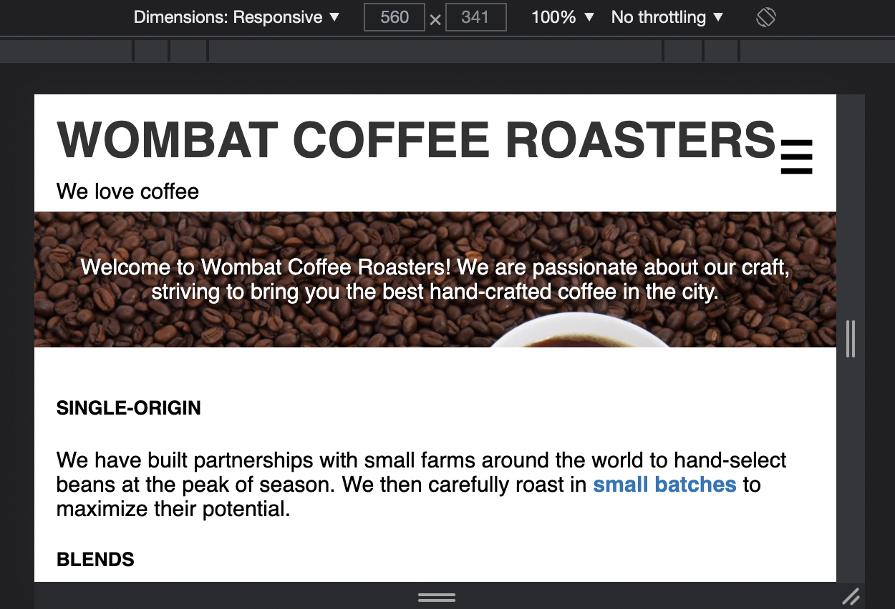

# Listing-8.7

レスポンシブデザインを実現するための原則の 1 つは `@media` クエリを使用してさまざまな環境下でのスタイル適用を条件付けすることである。

例えば以下の設定を追加すれば、ユーザーのデバイスのビューポート幅が `560px` 以上の場合にのみ、`font-size` の変更が適用される。

```css
@media (min-width: 560px) {
  .title > h1 {
    font-size: 2.25rem;
  }
}
```

一般的にはユーザーがページを拡大したり、デフォルトのフォントサイズを変更している可能性を考慮して、`em` 単位で条件付けを行うといい。例えば、`560px` を指定したい場合なら、`35em (= 560 / 16)` を指定すればいい。

```css
.title > h1 {
  color: #333;
  text-transform: uppercase;
  font-size: 1.5rem;
  margin: 0.2em 0;
}

@media (min-width: 35em) {
  .title > h1 {
    font-size: 2.25rem;
  }
}
```

これで `560px` 未満までの場合はフォントサイズは `1.5rem` が基準となっているが、



ビューポート幅が `560px` 以上になるとフォントサイズが `2.25rem` を基準として拡大されていることがわかる。



他にも `@media` クエリで指定することが可能なメディアタイプには以下のようなものが存在する。

| media type               | description                       |
| :----------------------- | :-------------------------------- |
| `min-height: 20em`       | 20em and taller                   |
| `max-height: 20em`       | 20em and shorter                  |
| `orientation: landscape` | wider than taller                 |
| `orientation: portrait`  | taller than wider                 |
| `min-resolution: 2dppx`  | 2 dots over / pixel (like Retina) |
| `max-resolution: 2dppx`  | 2 dots below / pixel              |

解像度に関するメディアクエリはサポートしていないブラウザも存在しているため、以下のように複数のターゲットを選択する必要がある。

```css
@media (-webkit-min-device-pixel-ratio: 2), (min-resolution: 192dppx) {
  /* ...  */
}
```

またブラウザのスクリーンで適用するスタイルと、印刷時に適用するスタイルとを以下のようにメディアタイプを使用して分割することができる。

```css
@media screen {
  /* 印刷時にはフォント色やテキストブロックの背景にある画像や色を削除したりなど */
  * {
    color: black !important;
    background: none !important;
  }
}
```
