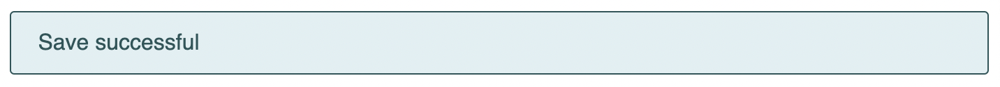

# Listing-9.3

では下記の HTML 構造に対して、どのように CSS をモジュール化させていくのか考える。

```html
<div class="message">Save successful</div>
```

そこで以下のようなメッセージに対して適用したいスタイルを考える。

```css
.message {
  padding: 0.8em 1.2em;
  border-radius: 0.2em;
  border: 1px solid #265559;
  color: #265559;
  background-color: #e0f0f2;
}
```

これで以下のような表示にできる。



ここではセレクタを `.message` のように単一のものにしておくことで、ページのどこでも自由に適用することのできるスタイルとして利用することができる。

つまり再利用可能な単一のモジュールとしてリファクタリングを行い、ページ上の場所に関係なく機能するようにすることで、コードをシンプルにすることができ、見た目の一貫性も確保することができる。
