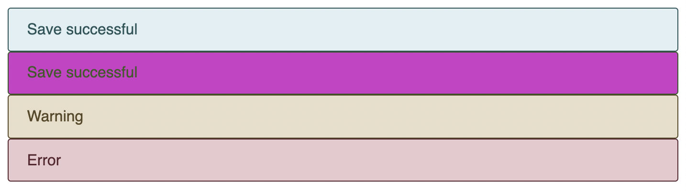

# Listing-9.5

**modifier** を使用することで以下のように特定の状況で適用したいスタイルを指定できる。

```html
<div class="message">Save successful</div>

<div class="message message--success">Save successful</div>

<div class="message message--warning">Warning</div>

<div class="message message--error">Error</div>
```

これで以下のように変更したいスタイルを指定できる。


