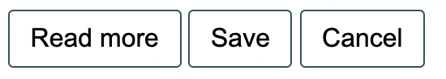
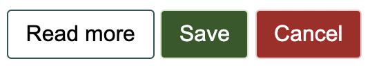
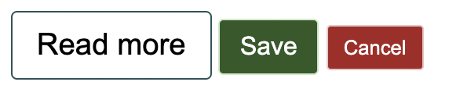

# Listing-9.6

次に同じ手順で以下のように適用可能なモジュールを作成する。

```html
<button class="button button--large">Read more</button>
<button class="button button--success">Save</button>
<button class="button button--danger button--small">Cancel</button>
```

まずはどのボタンにも適用可能なスタイルを作成する。

```css
.button {
  padding: 0.5em 0.8em;
  border: 1px solid #265559;
  border-radius: 0.2em;
  background-color: transparent;
  font-size: 1rem;
}
```

これで以下のようなボタンスタイルを作成することができた。



ここでまずは表示色の変更のために以下のスタイルを作成する。

```css
.button--success {
  border-color: #cfe8c9;
  color: #fff;
  background-color: #2f5926;
}

.button--danger {
  border-color: #e8c9c9;
  color: #fff;
  background-color: #a92323;
}
```

これで以下のようにセレクタを追加することでスタイルを変更することが可能となった。



あとはサイズ調整のために、フォントサイズを変更できるスタイルを作成する。フォントサイズを変更することで、要素内の `em` サイズを調整し、余白や半径などの宣言された値を上書きすることなく変更することができる。

```css
.button--small {
  font-size: 0.8em;
}

.button--large {
  font-size: 1.2em;
}
```

これで以下のようにセレクタを追加することで、ボタンのサイズを調整することが可能となった。


